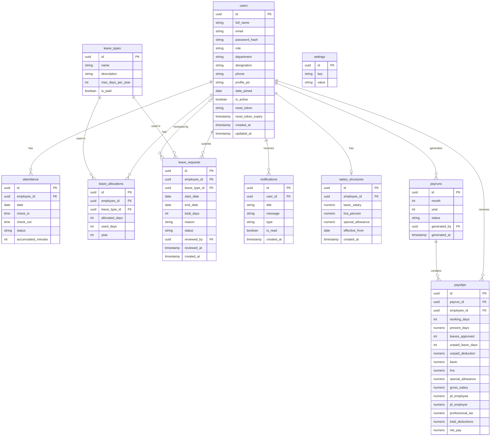

# Database Schema – EmPay HRMS

```mermaid
erDiagram
    users {
        uuid id PK
        string full_name
        string email
        string password_hash
        string role
        string department
        string designation
        string phone
        string profile_pic
        date date_joined
        boolean is_active
        string reset_token
        timestamp reset_token_expiry
        timestamp created_at
        timestamp updated_at
    }

    attendance {
        uuid id PK
        uuid employee_id FK
        date date
        time check_in
        time check_out
        string status
        int accumulated_minutes
    }

    leave_types {
        uuid id PK
        string name
        string description
        int max_days_per_year
        boolean is_paid
    }

    leave_allocations {
        uuid id PK
        uuid employee_id FK
        uuid leave_type_id FK
        int allocated_days
        int used_days
        int year
    }

    leave_requests {
        uuid id PK
        uuid employee_id FK
        uuid leave_type_id FK
        date start_date
        date end_date
        int total_days
        string reason
        string status
        uuid reviewed_by FK
        timestamp reviewed_at
        timestamp created_at
    }

    notifications {
        uuid id PK
        uuid user_id FK
        string title
        string message
        string type
        boolean is_read
        timestamp created_at
    }

    salary_structures {
        uuid id PK
        uuid employee_id FK
        numeric basic_salary
        numeric hra_percent
        numeric special_allowance
        date effective_from
        timestamp created_at
    }

    payruns {
        uuid id PK
        int month
        int year
        string status
        uuid generated_by FK
        timestamp generated_at
    }

    payslips {
        uuid id PK
        uuid payrun_id FK
        uuid employee_id FK
        int working_days
        numeric present_days
        int leaves_approved
        int unpaid_leave_days
        numeric unpaid_deduction
        numeric basic
        numeric hra
        numeric special_allowance
        numeric gross_salary
        numeric pf_employee
        numeric pf_employer
        numeric professional_tax
        numeric total_deductions
        numeric net_pay
    }

    settings {
        uuid id PK
        string key
        string value
    }

    users ||--o{ attendance : "has"
    users ||--o{ leave_allocations : "has"
    users ||--o{ leave_requests : "submits"
    users ||--o{ notifications : "receives"
    users ||--o| salary_structures : "has"
    users ||--o{ payslips : "receives"
    users ||--o{ payruns : "generates"
    leave_types ||--o{ leave_allocations : "used in"
    leave_types ||--o{ leave_requests : "used in"
    payruns ||--o{ payslips : "contains"
    leave_requests }o--o| users : "reviewed by"
```